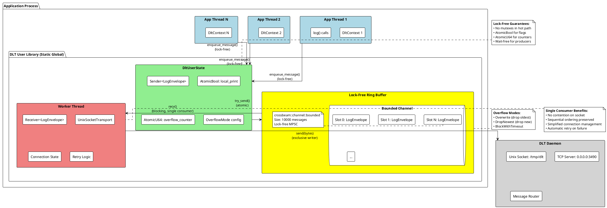
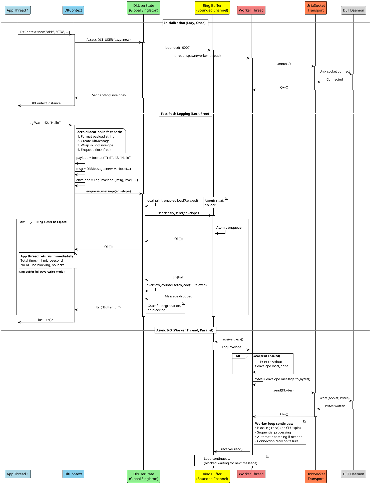
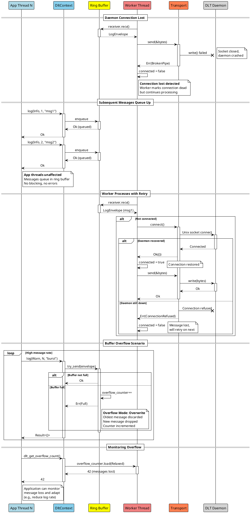
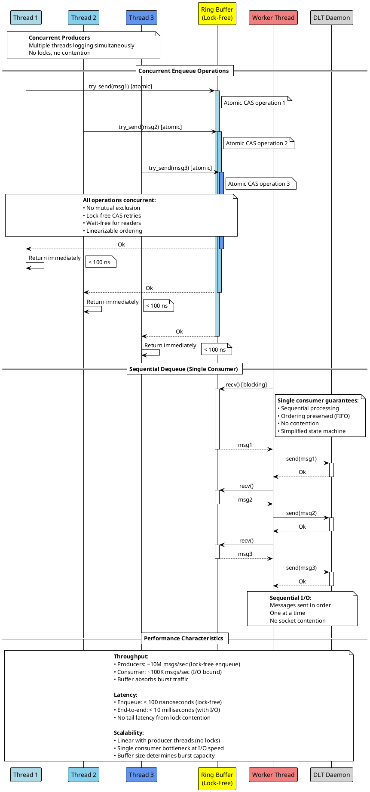

# Lockless Logging Design

## Overview

This document describes the lock-free, asynchronous logging architecture for libdlt-ng using the MPSC (Multi-Producer Single-Consumer) pattern with a ring buffer.

## Architecture Principles

1. **Zero-Lock Logging**: Application threads never block on locks when logging
2. **Async I/O**: Network I/O happens in dedicated worker thread, isolated from producers
3. **Bounded Ring Buffer**: Fixed-size queue with configurable overflow handling
4. **Atomic Operations**: All shared state uses lock-free atomics
5. **Single Writer**: Only one thread performs I/O to daemon (eliminates contention)

## Static Component View



## Dynamic Sequential View - Normal Logging Flow



## Dynamic Sequential View - Error Handling & Reconnection



## Dynamic Sequential View - Multi-Threaded Concurrent Logging



## Key Design Properties

### Lock-Free Properties

1. **Wait-Free Producers**: All logging threads complete in bounded time
2. **Obstruction-Free**: Progress guaranteed in absence of contention
3. **Linearizable**: Operations appear atomic and ordered
4. **ABA-Safe**: Using crossbeam's epoch-based reclamation

### Performance Characteristics

| Metric | Value | Notes |
|--------|-------|-------|
| Enqueue latency | < 100ns | Lock-free atomic operation |
| Throughput (producers) | ~10M msg/s | Limited by memory bandwidth |
| Throughput (consumer) | ~100K msg/s | Limited by socket I/O |
| Buffer capacity | 10,000 msgs | ~1MB memory at 100 bytes/msg |
| Overflow handling | Configurable | Drop/overwrite/timeout |

### Comparison with C Implementation

| Aspect | C (dlt_user.c) | Rust (libdlt-ng) |
|--------|----------------|------------------|
| Locking | pthread_mutex with reentry counter | None (lock-free atomics) |
| Ring buffer | Custom implementation | crossbeam bounded channel |
| Worker thread | Housekeeper thread with mutex | Single dedicated worker |
| Overflow | Drop with counter | Configurable modes |
| Memory safety | Manual management | Guaranteed by Rust |

### Thread Safety Guarantees

1. **Data Race Freedom**: All shared state protected by atomics or channel
2. **Send Safety**: LogEnvelope is Send, can cross thread boundaries
3. **Sync Safety**: DltUserState properly synchronized
4. **No Deadlocks**: No locks to deadlock on
5. **No Priority Inversion**: Lock-free means no priority issues

### Failure Modes

1. **Buffer Full**: Configurable drop/overwrite/timeout
2. **Daemon Unavailable**: Messages queue, automatic retry
3. **Connection Lost**: Automatic reconnection in worker
4. **Worker Thread Panic**: Should be prevented, but would stop logging
5. **Memory Exhaustion**: Bounded buffer prevents unbounded growth

## Usage Examples

### Basic Logging
```rust
let ctx = DltContext::new("APP", "CTX", "My App", "My Context");
ctx.log(DltLogLevel::Info, 0, "Hello")?; // Returns immediately
```

### High-Frequency Logging
```rust
for i in 0..1_000_000 {
    ctx.log(DltLogLevel::Debug, i, "Message")?; // No blocking
}
```

### Monitoring Overflow
```rust
let lost = dlt_get_overflow_count();
if lost > 0 {
    eprintln!("Warning: {} messages lost due to buffer overflow", lost);
}
```

### Local Printing
```rust
dlt_enable_local_print();
ctx.log(DltLogLevel::Warn, 0, "This will print locally too")?;
```

## Future Enhancements

1. **Adaptive Batching**: Batch multiple messages into single send() call
2. **Prioritized Queues**: Multiple ring buffers by log level
3. **Shared Memory**: Bypass socket for same-machine daemon
4. **Zero-Copy**: Send directly from ring buffer without copying
5. **Back-pressure**: Signal producers when buffer is filling up
